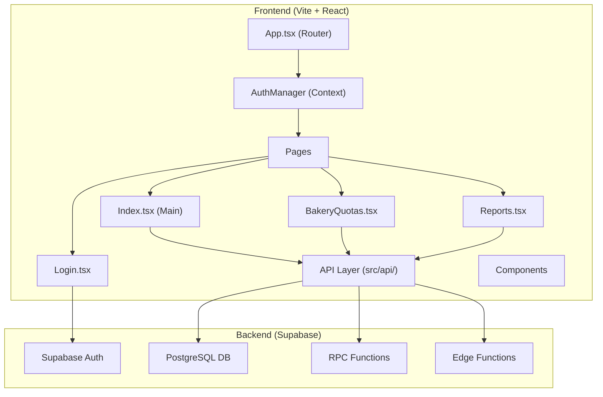

# TaskManagementSolution — Full Project Analysis

## Project Overview

This is a **React + TypeScript** web application for internal task management and bakery quota tracking, built with **Vite**, styled with **Tailwind CSS + shadcn/ui**, backed by **Supabase** (auth, database, edge functions), and deployed on **Vercel**.

| Aspect | Details |
|--------|---------|
| **Framework** | React 18.3 + Vite 6.3 |
| **Language** | TypeScript 5.5 (98.8% of codebase) |
| **UI Library** | shadcn/ui (Radix primitives) + Tailwind CSS 3.4 |
| **Backend** | Supabase (PostgreSQL + Auth + Edge Functions) |
| **State Management** | TanStack React Query 5.56 |
| **Routing** | React Router DOM 6.26 |
| **Charts** | Recharts 2.12 |
| **Deployment** | Vercel (SPA with rewrites) |
| **Package Manager** | pnpm |
| **Live URL** | [task-management-solution.vercel.app](https://task-management-solution.vercel.app) |

---

## Architecture Diagram



---

## File Structure Summary

```
TaskManagementSolution/
├── public/
│   ├── favicon.ico
│   ├── placeholder.svg
│   ├── robots.txt
│   └── تعديلات مخابز القاهرة.xlsx    ⚠️ Data file committed to repo
├── src/
│   ├── api/
│   │   ├── tasks.ts                    API layer for tasks
│   │   └── bakery-quotas.ts            API layer for bakery quotas
│   ├── components/
│   │   ├── ui/                         ~40 shadcn/ui primitives
│   │   ├── AuthManager.tsx             Auth context provider
│   │   ├── Sidebar.tsx                 Navigation sidebar
│   │   ├── TaskForm.tsx                Task create/edit form
│   │   ├── TaskCard.tsx                Task display card
│   │   ├── TaskList.tsx                Task list container
│   │   ├── TaskChart.tsx               Task status chart
│   │   ├── TaskLoadChart.tsx           Task load visualization
│   │   ├── TaskComments.tsx            Task comments
│   │   ├── TaskHistory.tsx             Task change history
│   │   ├── BakeryQuotaForm.tsx         Bakery quota form
│   │   ├── BakeryQuotaTable.tsx        Bakery quota table
│   │   ├── BakeryQuotaHistory.tsx      Quota change history
│   │   ├── BakeryQuotaStats.tsx        Quota statistics
│   │   ├── ImportBakeryQuotas.tsx      Excel import
│   │   ├── ExportBakeryQuotas.tsx      Excel export
│   │   ├── ExportTasks.tsx             Task export
│   │   ├── KPICards.tsx                KPI dashboard cards
│   │   ├── Pagination.tsx              Pagination component
│   │   ├── Highlighter.tsx             Search text highlighter
│   │   ├── Footer.tsx                  App footer
│   │   ├── Logo.tsx                    App logo
│   │   └── made-with-dyad.tsx          Dyad branding
│   ├── hooks/
│   │   ├── use-mobile.tsx              Mobile detection
│   │   └── use-toast.ts               Toast hook
│   ├── integrations/
│   │   └── supabase/
│   │       └── client.ts              Supabase client config ⚠️
│   ├── lib/
│   │   └── utils.ts                   cn() utility
│   ├── pages/
│   │   ├── Index.tsx                  Main page (~20KB!) ⚠️
│   │   ├── BakeryQuotas.tsx           Bakery quotas page (~16KB)
│   │   ├── Reports.tsx                Reports & charts
│   │   ├── Login.tsx                  Auth login
│   │   └── NotFound.tsx               404 page
│   ├── types/
│   │   └── task.ts                    Task type definitions
│   ├── utils/
│   │   ├── debugLogger.ts             Debug logging utility
│   │   └── toast.ts                   Toast helper
│   ├── App.tsx                        Router setup
│   ├── App.css                        App styles
│   ├── globals.css                    Global styles
│   └── main.tsx                       Entry point
├── supabase/
│   └── functions/
│       ├── get-user-email/index.ts    Edge function: get user email
│       └── import-bakery-quotas/index.ts  Edge function: import quotas
├── package.json
├── tailwind.config.ts
├── vite.config.ts
├── vercel.json
└── AI_RULES.md
```

---

## 🔴 CRITICAL Issues (Fix ASAP)

### 1. Supabase Credentials Exposed in Public Repository

> [!CAUTION]
> The Supabase URL and anon key are **hardcoded** in `src/integrations/supabase/client.ts` and the repository is now **public**. While the anon key is designed to be public, having it in a public repo alongside your project URL exposes your exact Supabase instance to anyone.

```typescript
// src/integrations/supabase/client.ts
const SUPABASE_URL = "https://wxhinjdceqneufvanfqe.supabase.co";
const SUPABASE_PUBLISHABLE_KEY = "eyJhbGciOiJIUzI1NiIs...";
```

**Risk**: If RLS (Row Level Security) is not perfectly configured on every table, anyone could read/write data.

**Recommendation**: 
- Move to environment variables (`import.meta.env.VITE_SUPABASE_URL`)
- Make the repo private again after this review
- Audit all RLS policies in Supabase dashboard
- Rotate keys if needed

### 2. Sensitive Data File Committed to Repository

> [!CAUTION]
> An Excel file `public/تعديلات مخابز القاهرة.xlsx` (20KB) containing actual business data ("Cairo Bakeries Modifications") is committed to the public repo.

**Risk**: Business data exposure to anyone who visits the repo.

**Recommendation**: Remove immediately with `git filter-branch` or BFG Repo-Cleaner, add `.xlsx` to `.gitignore`.

### 3. Edge Function CORS: `Access-Control-Allow-Origin: *`

> [!WARNING]
> Both edge functions (`get-user-email`, `import-bakery-quotas`) use a wildcard CORS origin:
> ```typescript
> 'Access-Control-Allow-Origin': '*'
> ```

**Risk**: Any website can call your edge functions, not just your app.

**Recommendation**: Restrict to your Vercel domain(s): `'Access-Control-Allow-Origin': 'https://task-management-solution.vercel.app'`

---

## 🟡 Architecture & Code Quality Issues

### 4. Massive Page Components ("God Components")

> [!IMPORTANT]
> `Index.tsx` is **~20KB / ~500+ lines** and `BakeryQuotas.tsx` is **~16KB / ~400+ lines**. These are "God Components" — they handle state management, API calls, mutations, filtering, sorting, pagination, overdue notifications, tab routing, and UI rendering all in one file.

**Problems**:
- Extremely difficult to maintain and debug
- Hard to test individual pieces
- High risk of regressions when changing anything
- Performance issues (entire component re-renders on any state change)

**Recommendation**: Extract into custom hooks and smaller components:
```
// Proposed structure
src/hooks/useTasks.ts          → data fetching + mutations
src/hooks/useTaskFilters.ts    → filtering/sorting/search logic
src/hooks/useOverdueNotifications.ts → notification logic
src/pages/Index.tsx            → just composition of components
```

### 5. No Separation Between Modules

The app has **two distinct business domains** (Tasks and Bakery Quotas) but they're mixed together in flat directories. There's no feature-based organization.

**Recommendation**: Adopt feature-based folder structure:
```
src/features/
  tasks/
    api/
    components/
    hooks/
    types/
    pages/
  bakery-quotas/
    api/
    components/
    hooks/
    types/
    pages/
  shared/
    components/
    hooks/
    utils/
```

### 6. Type Definitions Are Incomplete and Scattered

- `src/types/task.ts` defines `Task` and `TaskStatus` but types are truncated/incomplete
- `BakeryQuota`, `BakeryQuotaHistory`, and related types are defined inside `src/api/bakery-quotas.ts` instead of dedicated type files
- `TaskHistoryEntry` and `Comment` types are defined inside `src/api/tasks.ts`
- No shared database types from Supabase auto-generation

**Recommendation**: 
- Use `supabase gen types typescript` to auto-generate database types
- Centralize all types in dedicated type files per feature
- Keep API files focused on API logic only

### 7. Tasks Fetching — All Records Loaded at Once

```typescript
// src/api/tasks.ts
export const getTasks = async (): Promise<Task[]> => {
  const { data, error } = await supabase.rpc('get_tasks_with_creator_email');
  // Returns ALL tasks
};
```

> [!WARNING]
> Unlike Bakery Quotas (which use server-side pagination via RPC), **Tasks loads ALL records at once**. With "lots of records" on the server, this will cause:
> - Slow initial page load
> - High memory usage on client
> - Unnecessary data transfer

**Recommendation**: Implement server-side pagination for tasks (like you did for bakery quotas with `get_paginated_bakery_quotas` RPC).

### 8. Reports Page Fetches All Tasks Too

```typescript
// src/pages/Reports.tsx
const { data: tasks } = useQuery<Task[]>({
  queryKey: ['tasks'],
  queryFn: getTasks,  // ALL tasks
});
```

Then applies client-side date filtering with `date-fns`. This means downloading all records just to filter them in the browser.

**Recommendation**: Create a server-side RPC for aggregated report data, sending only summaries instead of raw records.

---

## 🟡 Security Issues

### 9. No Route Protection

```typescript
// App.tsx
<Routes>
  <Route path="/" element={<Index />} />
  <Route path="/login" element={<Login />} />
  <Route path="*" element={<NotFound />} />
</Routes>
```

There's an `AuthProvider` wrapper, but looking at the routing — there's no **protected route** component. If a user navigates directly to `/` without being logged in, they might see a broken state before being redirected.

**Recommendation**: Create a `<ProtectedRoute>` wrapper component:
```tsx
const ProtectedRoute = ({ children }) => {
  const { session, loading } = useAuth();
  if (loading) return <LoadingSpinner />;
  if (!session) return <Navigate to="/login" />;
  return children;
};
```

### 10. Edge Function Auth Bypass Risk

In `get-user-email/index.ts`, the function accepts a `user_id` as input and uses a **service role key** to look up the user's email. This means:
- Any authenticated user can look up any other user's email
- No validation that the requesting user should have access to that information

**Recommendation**: Validate that the requesting user has permission to view the requested user's data.

---

## 🟡 Performance Issues

### 11. Excessive Query Invalidation

```typescript
// BakeryQuotas.tsx
onSuccess: () => {
  queryClient.invalidateQueries({ queryKey: ['bakeryQuotas'] });
  queryClient.invalidateQueries({ queryKey: ['bakeryQuotaStatsToday'] });
  queryClient.invalidateQueries({ queryKey: ['bakeryQuotaStatsWeek'] });
  queryClient.invalidateQueries({ queryKey: ['bakeryQuotaStatsMonth'] });
  queryClient.invalidateQueries({ queryKey: ['bakeryQuotaStatsPerClientToday'] });
  // 5 separate invalidations on every mutation!
};
```

Every create/update/delete triggers **5 separate query invalidations**, causing 5 separate API calls.

**Recommendation**: Use a common query key prefix pattern:
```typescript
queryClient.invalidateQueries({ queryKey: ['bakeryQuotas'] }); // Invalidates all bakeryQuotas* queries
```

### 12. No Loading States / Skeleton UI

While queries use `isLoading`, there are no skeleton screens or shimmer effects. Users see empty states or spinners.

**Recommendation**: Use shadcn/ui `<Skeleton />` component (already installed!) for table rows, cards, and charts.

### 13. Missing React.memo and useCallback

Large components with many event handlers and child components are not memoized. Every state change (e.g., typing in search) re-renders the entire page tree.

---

## 🟢 Enhancement Opportunities

### 14. No Error Boundary

If any component crashes, the entire app goes blank. There's no error boundary catching React errors.

**Recommendation**: Add a global `<ErrorBoundary>` component at the app level.

### 15. Missing `.env` Configuration

No `.env` or `.env.example` file exists. All configuration is hardcoded.

**Recommendation**: Create `.env.example` with required variables:
```env
VITE_SUPABASE_URL=
VITE_SUPABASE_ANON_KEY=
```

### 16. Missing Database Types Auto-Generation

The project doesn't use `supabase gen types typescript` for type safety. All database types are manually written and potentially out of sync with the actual schema.

**Recommendation**: Set up auto-generation and add it to the build pipeline.

### 17. No Test Suite

Zero tests — no unit tests, no integration tests, no E2E tests.

**Recommendation**: At minimum, add:
- **Vitest** for unit tests (already compatible with Vite)
- **Testing Library** for component tests
- **Playwright** for E2E tests of critical flows (login, create task, create quota)

### 18. Task Status Uses Arabic String Literals

```typescript
export type TaskStatus = 'لم يتم' | 'ستتم المتابعة مرة اخرى' | 'تم التنفيذ';
```

Using Arabic text as type discriminators is fragile and error-prone. A typo or encoding issue breaks the entire status system.

**Recommendation**: Use English enum values internally with Arabic display labels:
```typescript
export enum TaskStatus {
  NOT_DONE = 'not_done',
  FOLLOW_UP = 'follow_up', 
  COMPLETED = 'completed',
}
// With a display map
const statusLabels: Record<TaskStatus, string> = {
  [TaskStatus.NOT_DONE]: 'لم يتم',
  ...
};
```

> [!WARNING]
> **Database impact**: This would require a migration to update existing records. Since you have live data, this needs a careful migration plan with a mapping from old Arabic values to new English values.

### 19. No Internationalization (i18n) Framework

Arabic text is hardcoded throughout components. If you ever need to support English or other languages, every string must be extracted.

**Recommendation**: Consider `react-i18next` even if you only support Arabic now.

### 20. No Audit Log / Activity Stream

While there's task history and bakery quota history, there's no unified audit log. Who changed what, when?

### 21. No Real-time Updates

Multiple users can work simultaneously, but there's no Supabase Realtime subscription. If User A creates a task, User B won't see it until they refresh.

**Recommendation**: Use Supabase Realtime channels:
```typescript
supabase.channel('tasks').on('postgres_changes', { event: '*', schema: 'public', table: 'tasks' }, 
  () => queryClient.invalidateQueries(['tasks'])
).subscribe();
```

### 22. No PWA / Offline Support

For a task management app used in the field, PWA support with offline caching would be valuable.

### 23. Missing README

The README is only 28 bytes — essentially empty. No setup instructions, no architecture docs, no contributing guidelines.

---

## 📦 Dependencies Review

### Potentially Unused Dependencies
These UI primitives from shadcn/ui are installed but may not all be actively used:
- `@radix-ui/react-hover-card`
- `@radix-ui/react-menubar`
- `@radix-ui/react-navigation-menu`
- `@radix-ui/react-aspect-ratio`
- `embla-carousel-react`
- `input-otp`
- `react-resizable-panels`
- `vaul`
- `cmdk`

**Recommendation**: Audit actual usage and remove unused dependencies to reduce bundle size.

### Dev Dependencies
- `@dyad-sh/react-vite-component-tagger` — Dyad-specific dev tool, probably not needed if not using Dyad IDE

---

## 🎯 Prioritized Recommendations

### Phase 1: Immediate (Safety & Security)
| # | Action | Risk if Ignored |
|---|--------|----------------|
| 1 | Move Supabase keys to environment variables | Data breach |
| 2 | Remove Excel data file from repo + git history | Data exposure |
| 3 | Make repo private again | Combined risk of #1 + #2 |
| 4 | Restrict CORS in edge functions | Unauthorized API access |
| 5 | Audit Supabase RLS policies | Data manipulation |

### Phase 2: Short-term (Performance & Stability)
| # | Action | Impact |
|---|--------|--------|
| 6 | Add server-side pagination for tasks | Performance |
| 7 | Add protected route wrapper | Security |
| 8 | Add error boundary | Stability |
| 9 | Create `.env.example` | Developer experience |
| 10 | Consolidate query invalidation | Performance |

### Phase 3: Medium-term (Code Quality)
| # | Action | Impact |
|---|--------|--------|
| 11 | Refactor God Components into hooks + components | Maintainability |
| 12 | Feature-based folder structure | Organization |
| 13 | Auto-generate Supabase types | Type safety |
| 14 | Add skeleton loading states | UX |
| 15 | Audit and remove unused dependencies | Bundle size |

### Phase 4: Long-term (Features & Quality)
| # | Action | Impact |
|---|--------|--------|
| 16 | Add Vitest + Testing Library | Reliability |
| 17 | Add Supabase Realtime for live updates | Multi-user UX |
| 18 | Migrate status values to English enums | Maintainability |
| 19 | Consider i18n framework | Future-proofing |
| 20 | Add comprehensive README | Onboarding |

---

## Overall Assessment

> [!NOTE]
> **The Good**: The app is functional and deployed. It uses modern tooling (Vite, TanStack Query, shadcn/ui, Supabase). The bakery quotas module demonstrates good patterns (server-side pagination via RPC, chunked imports via edge functions, history tracking). Arabic RTL support is present.
>
> **The Concerning**: Security is the top priority — exposed credentials, public data files, and wildcard CORS need immediate attention. Code architecture is showing signs of technical debt with oversized components and mixed concerns. Performance will degrade as data grows since tasks load everything client-side.
>
> **The Verdict**: Solid foundation, but needs a careful security pass and incremental refactoring — especially since it's a production system with real data.
